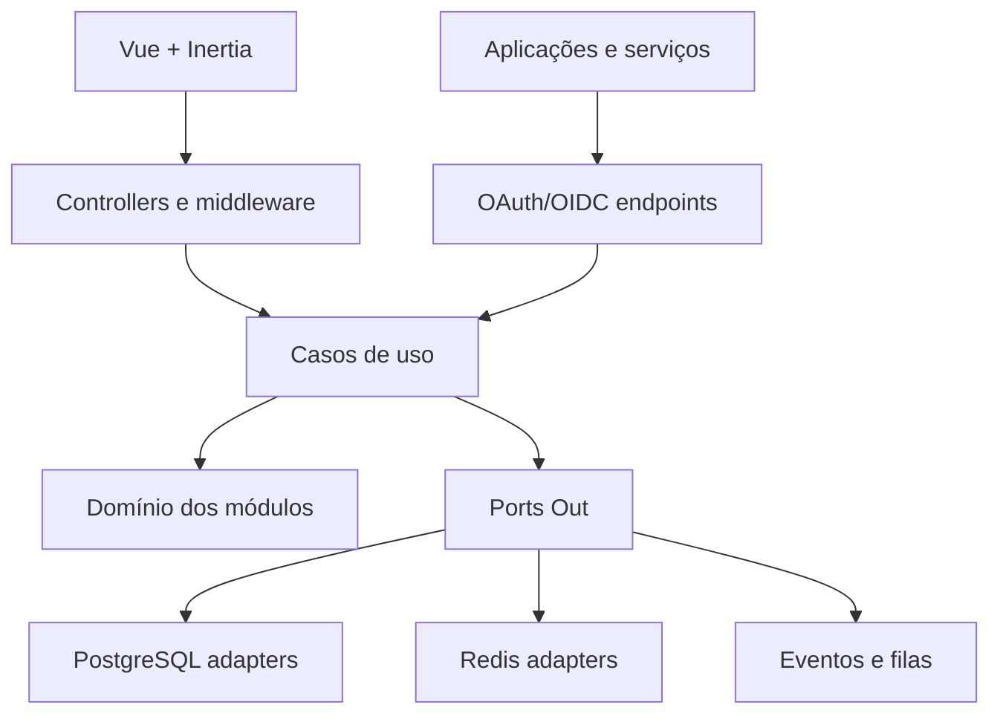

# TRD — Laravel DDD Skeleton with Identity Platform

**Versão:** 0.1  
**Status:** Rascunho técnico para validação  
**Data:** 24 de julho de 2026  
**PRD de origem:** `PRD-Identity-Platform-v0.1.md`  
**Licença:** MIT  

---

## 1. Objetivo

Este documento traduz o PRD em uma solução técnica implementável. O produto será um skeleton Laravel clonável, com arquitetura modular e hexagonal por padrão, contendo uma Identity Platform pronta para autenticação, autorização, multi-tenancy, OAuth 2.0, OpenID Connect, MFA, auditoria e comunicação máquina a máquina.

O skeleton deve permitir que um novo sistema comece pela implementação de seus módulos de negócio, sem reconstruir capacidades transversais. Um clone pode, por exemplo, originar uma plataforma de observabilidade baseada em OpenTelemetry, adicionando módulos de coleta, análise e diagnóstico sobre a base de identidade já disponível.

## 2. Escopo técnico do MVP

O MVP incluirá:

- instalação inicial e proprietário explícito;
- identidade global e organizações;
- módulos, permissões e papéis;
- papéis globais reutilizáveis e papéis organizacionais;
- concessões e negações diretas;
- senha temporária com troca obrigatória;
- MFA TOTP e códigos de recuperação;
- painel administrativo;
- OAuth 2.0 Authorization Code com PKCE;
- OpenID Connect sobre o fluxo Authorization Code;
- Client Credentials;
- ID Tokens e Access Tokens JWT assinados;
- sessões, Refresh Tokens, rotação e revogação;
- auditoria e política de retenção;
- personalização da instalação;
- aplicação Laravel de referência;
- Docker para desenvolvimento;
- instrumentação OpenTelemetry configurável;
- testes automatizados e validações arquiteturais.

## 3. Stack de referência

| Área | Escolha |
|---|---|
| Runtime | PHP 8.3 ou superior compatível |
| Framework | Laravel 13 |
| Arquitetura | Modular, vertical e hexagonal por padrão |
| Toolkit | `samuel-nunes/laravel-ddd-toolkit` |
| OAuth 2.0 | Laravel Passport |
| OpenID Connect | Camada própria sobre Passport |
| Banco | PostgreSQL 18.x |
| Cache e filas | Redis com extensão PhpRedis |
| Frontend | Vue 3 Composition API + TypeScript |
| Integração frontend/backend | Inertia 3 |
| UI | Tailwind CSS 4 + componentes shadcn-vue adaptados |
| Build frontend | Vite |
| Testes backend | PHPUnit |
| Testes E2E | Playwright com TypeScript |
| Qualidade PHP | Laravel Pint + Larastan/PHPStan + Psalm Taint Analysis |
| Observabilidade | OpenTelemetry PHP + OTLP |
| Contêineres | Docker Compose no desenvolvimento |

As versões menores devem ser fixadas pelo lockfile. Atualizações de dependências passam por testes automatizados e análise de compatibilidade.

## 4. Decisões arquiteturais

As decisões com impacto duradouro estão registradas nos ADRs:

| ADR | Decisão |
|---|---|
| ADR-001 | Monólito modular com módulos verticais e arquitetura hexagonal |
| ADR-002 | Multi-tenancy em banco compartilhado e contexto organizacional explícito |
| ADR-003 | Passport como servidor OAuth 2.0 e camada OIDC própria |
| ADR-004 | Modelo de autorização por módulo, papéis, sobrescritas e delegação |
| ADR-005 | JWT, sessões, versionamento de autorização e revogação |
| ADR-006 | Vue 3, Inertia 3 e TypeScript no painel |
| ADR-007 | Soft delete, auditoria imutável e retenção |

## 5. Visão da arquitetura



O sistema será implantado inicialmente como um único artefato Laravel. Os limites entre módulos devem permanecer explícitos, permitindo extração futura sem exigir essa complexidade no MVP.

## 6. Organização do código

Estrutura de referência:

```text
app/
  Modules/
    Identity/
      Domain/
      Application/
        DTO/
        UseCases/
        Ports/
          In/
          Out/
      Infrastructure/
        Http/
          Controllers/
          Requests/
          Resources/
        Persistence/
          Adapters/
          Models/
        Providers/
    Organization/
    AccessControl/
    ModuleCatalog/
    OAuth/
    Mfa/
    Session/
    Audit/
    Installation/
  Shared/
    Domain/
    Application/
    Infrastructure/
```

Regras:

1. Controllers ficam em `Infrastructure/Http/Controllers`.
2. Form Requests validam formato, autenticação básica da requisição e campos.
3. Controllers constroem DTOs e chamam casos de uso.
4. Regras de negócio ficam no domínio ou em casos de uso.
5. Ports Out ficam em `Application/Ports/Out`.
6. Adapters de persistência ficam em `Infrastructure/Persistence/Adapters`.
7. Repositories não ficam no domínio.
8. `make:repository` é opt-in; `make:port` e `make:adapter` são o caminho preferencial quando existe fronteira real.
9. Um módulo não acessa modelos Eloquent de outro módulo diretamente.
10. Comunicação síncrona entre módulos usa Port In ou contrato de aplicação.
11. Comunicação assíncrona usa eventos de integração versionados.
12. `Shared` deve permanecer mínimo e não pode se tornar um domínio genérico.

Comandos esperados:

```bash
composer require samuel-nunes/laravel-ddd-toolkit
php artisan ddd:install
php artisan make:module Identity
php artisan make:port Identity IdentityRepository --type=out
php artisan make:adapter Identity EloquentIdentityRepository --port=IdentityRepository --type=persistence
php artisan ddd:check
```

## 7. Módulos internos

| Módulo | Responsabilidade |
|---|---|
| Installation | Bootstrap, proprietário e identidade visual |
| Identity | Identidades, credenciais e senha temporária |
| Organization | Organizações, memberships e preferência de organização |
| ModuleCatalog | Módulos, audiences, habilitações e OAuth Clients |
| AccessControl | Permissões, papéis, atribuições, overrides e cálculo efetivo |
| OAuth | Authorization Server, OIDC, tokens e JWKS |
| Mfa | TOTP, recuperação e step-up |
| Session | Sessões web, Refresh Tokens e revogação |
| Audit | Eventos de auditoria, retenção e consulta |

Módulos de negócio adicionados por quem clonar o skeleton ficam em `app/Modules/{Nome}` e reutilizam os contratos de identidade e autorização sem depender da infraestrutura interna da Identity Platform.

## 8. Modelo multi-tenant

### 8.1 Estratégia

- uma instalação possui um banco lógico;
- todas as organizações compartilham o mesmo schema;
- identidade é global;
- dados organizacionais possuem `organization_id`;
- o contexto organizacional é obrigatório em operações organizacionais;
- filtros não dependem apenas de scopes Eloquent implícitos;
- autorização no servidor valida organização, módulo e permissão;
- chaves estrangeiras usam `RESTRICT`, sem cascatas destrutivas em entidades auditáveis.

### 8.2 Resolução do contexto

`OrganizationContext` é um objeto imutável criado após validação do membership. Ele contém:

```text
identity_id
organization_id
module_id opcional
source: session | access_token | client_credentials
authorization_version
```

Ele é injetado nos casos de uso organizacionais. Nenhum parâmetro `organization_id` recebido do frontend é confiável antes dessa resolução.

### 8.3 Última organização

A tabela de preferência mantém uma organização por identidade, não por módulo. A preferência é apenas uma sugestão e deve ser revalidada para o OAuth Client ou módulo atual.

## 9. Modelo de dados

Identificadores de domínio usam UUID v7 gerado pela aplicação e armazenado no tipo nativo `uuid`; nas fronteiras HTTP são serializados em texto. Datas usam `timestamp with time zone` (`timestamptz`) e são tratadas em UTC. Metadados sem estrutura relacional estável podem usar `jsonb`, sempre com schema de aplicação e índices apenas quando houver padrão de consulta comprovado.

### 9.1 Tabelas principais

| Tabela | Campos essenciais |
|---|---|
| `installations` | `id`, `owner_identity_id`, nomes, cores, locale, timezone, suporte |
| `identities` | `id`, `email_normalized`, nome, status, `must_change_password`, `authorization_version`, `deleted_at` |
| `identity_credentials` | `identity_id`, hash de senha, `temporary_expires_at`, `changed_at` |
| `identity_preferences` | `identity_id`, `last_organization_id` |
| `organizations` | `id`, identificador, nome, `mfa_policy`, status, `deleted_at` |
| `memberships` | `id`, `identity_id`, `organization_id`, status, vigência, `deleted_at` |
| `modules` | `id`, identificador, nome, status, `deleted_at` |
| `organization_modules` | `id`, `organization_id`, `module_id`, status, `deleted_at` |
| `permissions` | `id`, `module_id`, código, descrição, criador/contexto, status, `deleted_at` |
| `roles` | `id`, `module_id`, `organization_id` anulável, código, nome, status, `deleted_at` |
| `role_permissions` | `id`, `role_id`, `permission_id`, vigência, `deleted_at` |
| `identity_role_assignments` | `id`, `identity_id`, `organization_id`, `module_id`, `role_id`, vigência, `deleted_at` |
| `permission_overrides` | `id`, contexto completo, `effect`, vigência, `deleted_at` |
| `oauth_clients` | `id`, `module_id`, tipo, secret hash, grants, status, `deleted_at` |
| `oauth_client_redirect_uris` | `client_id`, URI exata |
| `oauth_client_audiences` | `client_id`, audience |
| `oauth_service_authorizations` | `client_id`, `organization_id`, `module_id`, `permission_id`, status, `deleted_at` |
| `web_sessions` | sessão, identidade, autenticação, IP, user agent, expiração, revogação |
| `mfa_methods` | identidade, tipo, segredo cifrado, confirmação |
| `mfa_recovery_codes` | identidade, hash, uso |
| `audit_events` | ator, ação, alvo, organização, antes/depois protegidos, IP, sessão, resultado |

As tabelas OAuth técnicas do Passport são adaptadas por migrations próprias sem alterar seus contratos públicos de forma desnecessária.

### 9.2 Restrições de unicidade

- `identities.email_normalized`;
- `modules.identifier`;
- `organizations.identifier`;
- `permissions(module_id, code)` entre registros ativos;
- papel global: `roles(module_id, code)` quando `organization_id` for nulo;
- papel organizacional: `roles(organization_id, module_id, code)`;
- uma sobrescrita ativa por identidade, organização, módulo e permissão;
- uma habilitação ativa por organização e módulo;
- um membership ativo por identidade e organização.

## 10. Cálculo de autorização

Entrada:

```text
identity + organization + module
```

Pré-condições:

1. identidade ativa;
2. organização ativa;
3. membership ativo;
4. módulo ativo;
5. módulo habilitado para a organização;
6. ao menos um papel ativo no contexto.

Algoritmo:

```text
inherited = união das permissões ativas dos papéis ativos
granted   = overrides ativos com efeito CONCEDER
denied    = overrides ativos com efeito NEGAR
effective = (inherited ∪ granted) - denied
```

Regras adicionais:

- override direto não existe sem papel ativo;
- `CONCEDER` e `NEGAR` são mutuamente exclusivos na mesma chave;
- zero permissões efetivas desativa o acesso ao módulo;
- permissão pertence a um módulo e pode ser reutilizada entre organizações;
- papel global pode ser reutilizado entre organizações;
- papel organizacional não sai da organização e do módulo de origem;
- criar, atualizar, atribuir e sobrescrever são capacidades separadas;
- o delegante não pode ultrapassar seu limite delegável.

### 10.1 Serviço de cálculo

`EffectivePermissionResolver` é um serviço de aplicação puro quanto à infraestrutura. Ports Out recebem snapshots normalizados dos adapters de persistência. O resultado contém permissões efetivas, origem, versão e motivos de negação.

### 10.2 Cache

Chave:

```text
authz:{identity_id}:{organization_id}:{module_id}:{authorization_version}
```

O cache é invalidado por eventos após commit. A versão é incrementada na mesma transação de alterações relevantes.

## 11. Delegação

O `DelegationPolicy` recebe:

- ator;
- organização;
- módulo;
- ação solicitada;
- permissões ou papéis alvo;
- permissões delegáveis do ator.

Ele deve rejeitar:

- operação fora da organização administrável;
- permissão de outro módulo;
- papel organizacional de outra organização;
- permissão acima do limite delegável;
- autoelevação;
- criação quando o ator possui apenas capacidade de atribuição;
- concessão ou negação para destinatário sem papel ativo.

## 12. Autenticação humana

### 12.1 Senha temporária

- administrador informa a senha somente na criação ou redefinição;
- apenas o hash é persistido;
- expiração padrão: 24 horas, configurável até o máximo de 72 horas;
- `must_change_password=true`;
- primeiro login válido redireciona para troca antes de OAuth/OIDC;
- alteração invalida sessões e credencial temporária anteriores;
- senha não aparece em logs ou auditoria.

### 12.2 Sessão

- cookie `Secure`, `HttpOnly` e `SameSite=Lax`;
- rotação do ID após autenticação e elevação de privilégio;
- timeout ocioso padrão de 2 horas;
- duração absoluta padrão de 12 horas;
- reautenticação para ações sensíveis;
- CSRF obrigatório nas rotas web.

### 12.3 MFA

- TOTP compatível com aplicativos autenticadores;
- segredo cifrado com chave da aplicação;
- QR Code exibido apenas durante configuração;
- confirmação por código antes de ativar;
- códigos de recuperação armazenados como hash e de uso único;
- proprietário e contas globais sensíveis sempre exigem MFA;
- política organizacional `OBRIGATÓRIO` ou `OPCIONAL`;
- step-up ao entrar em organização que exija MFA;
- `amr` registra `pwd` e `otp`.

## 13. OAuth 2.0 e OpenID Connect

### 13.1 Base OAuth

Laravel Passport fornecerá:

- registro técnico de clients;
- Authorization Code;
- PKCE;
- Client Credentials;
- emissão e verificação de Access Tokens;
- Refresh Tokens;
- revogação;
- chaves assimétricas.

O Password Grant e o Implicit Grant permanecerão desabilitados.

### 13.2 Camada OIDC

O módulo OAuth adicionará:

- `/.well-known/openid-configuration`;
- `/oauth/jwks`;
- `/oauth/userinfo`;
- suporte ao scope `openid`;
- emissão de ID Token no Token Endpoint;
- validação e propagação de `nonce`;
- `auth_time`, `amr`, `azp` quando aplicável;
- scopes `profile` e `email`;
- tratamento de `prompt=none` e `prompt=login`;
- consentimento administrativo para clients internos confiáveis.

O ID Token usa o mesmo conjunto de chaves assimétricas, com `kid` e rotação controlada.

### 13.3 Authorization Code com PKCE

- PKCE S256 obrigatório para clients públicos e confidenciais;
- Authorization Code válido por 60 segundos e uso único;
- Redirect URI por correspondência exata;
- `state` validado pelo client;
- `nonce` obrigatório nas solicitações OIDC;
- client, módulo, organização e autorização são vinculados ao code.

### 13.4 Consentimento

Todos os clients do MVP são internos e administrativamente confiáveis. Não existe tela interativa. A autorização administrativa, scopes e dados liberados permanecem auditáveis.

## 14. Client Credentials

Requisição:

```http
POST /oauth/token
Content-Type: application/x-www-form-urlencoded

grant_type=client_credentials&
client_id=...&
client_secret=...&
audience=sales-api&
organization_id=...
```

Regras:

- apenas client confidencial;
- secret armazenado como hash e exibido uma vez;
- organização pode ser omitida quando houver exatamente uma autorizada;
- client, módulo, organização, audience e permissões de serviço devem estar ativos;
- não há usuário, ID Token, MFA ou Refresh Token;
- scope `*` é proibido;
- token dura 5 minutos por padrão;
- `sub` representa o client;
- middleware diferencia principal humano e principal de serviço.

## 15. Tokens

### 15.1 Algoritmo

- assinatura assimétrica RS256 no MVP;
- chave privada fora do repositório;
- chave pública publicada em JWKS;
- `kid` obrigatório;
- rotação com período de sobreposição.

### 15.2 Access Token humano

Claims mínimas:

```json
{
  "iss": "https://identity.example.com",
  "sub": "identity-uuid",
  "sub_type": "identity",
  "aud": "sales-api",
  "client_id": "sales-web",
  "module_id": "sales",
  "organization_id": "organization-uuid",
  "permissions": ["sales.opportunities.view"],
  "authz_ver": 42,
  "jti": "token-uuid",
  "iat": 1784840400,
  "exp": 1784841000
}
```

Validade padrão: 10 minutos.

### 15.3 Access Token de serviço

```json
{
  "iss": "https://identity.example.com",
  "sub": "client-uuid",
  "sub_type": "client",
  "aud": "sales-api",
  "client_id": "client-uuid",
  "module_id": "sales",
  "organization_id": "organization-uuid",
  "permissions": ["sales.import.execute"],
  "jti": "token-uuid",
  "iat": 1784840400,
  "exp": 1784840700
}
```

### 15.4 ID Token

Validade padrão: 5 minutos. Claims: `iss`, `sub`, `aud`, `iat`, `exp`, `auth_time`, `nonce`, `amr` e claims permitidas por scopes. Permissões não são incluídas no ID Token.

### 15.5 Refresh Token

- validade padrão de 30 dias;
- rotação a cada uso;
- reutilização revoga a família;
- hash ou material protegido em repouso;
- negado após desativação, soft delete ou mudança incompatível de contexto.

## 16. Revogação e efeito de alterações

1. Alteração de acesso incrementa `authorization_version`.
2. Refresh Tokens incompatíveis são revogados.
3. Sessões afetadas podem ser encerradas conforme o evento.
4. Access Tokens permanecem limitados por validade curta.
5. APIs internas sensíveis com acesso ao Redis comparam `authz_ver`.
6. APIs externas podem usar endpoint autenticado de introspecção quando exigirem revogação quase imediata.
7. `jti` revogados são mantidos em Redis até a expiração original.

Eventos relevantes:

- `IdentityDisabled`;
- `MembershipDisabled`;
- `OrganizationDisabled`;
- `ModuleDisabled`;
- `RoleAssignmentChanged`;
- `PermissionOverrideChanged`;
- `ServiceAuthorizationChanged`;
- `OAuthClientRevoked`.

## 17. API e HTTP

### 17.1 Rotas administrativas

Prefixo:

```text
/admin
/api/admin/v1
```

Rotas Inertia atendem o painel. API JSON versionada atende automação futura e testes de contrato.

### 17.2 Erros

APIs retornam Problem Details:

```json
{
  "type": "https://docs.example.com/problems/forbidden",
  "title": "Forbidden",
  "status": 403,
  "code": "AUTHORIZATION_DENIED",
  "detail": "A operação não é permitida neste contexto.",
  "trace_id": "..."
}
```

Mensagens não revelam permissões sensíveis ao usuário final. Logs internos podem registrar motivo técnico sem segredos.

### 17.3 Idempotência

Criação de atribuições, rotação de secret e operações administrativas acionadas por integração aceitam `Idempotency-Key`. A chave é isolada por ator, rota e organização.

## 18. Frontend administrativo

Vue 3 + Inertia 3 será usado porque o painel possui formulários relacionais, filtros, seleção contextual, visualização de permissões efetivas e estados de segurança.

Diretrizes:

- TypeScript estrito;
- Composition API;
- páginas em `resources/js/pages`;
- componentes compartilhados pequenos;
- autorização visual baseada em capacidades fornecidas pelo servidor;
- servidor sempre revalida;
- tema derivado das configurações da instalação;
- contraste WCAG AA;
- telas responsivas;
- diferenciação visual entre herdada, concedida e negada;
- confirmação para desativação, soft delete e restauração;
- secrets exibidos uma única vez.

## 19. Persistência, cache e filas

### 19.1 PostgreSQL

- PostgreSQL 18.x;
- encoding UTF-8;
- UUID v7 no tipo nativo `uuid`;
- datas no tipo `timestamptz`;
- `jsonb` apenas para metadados que não justificam tabela própria;
- transações em alterações de acesso;
- índices compostos iniciando por contexto organizacional quando aplicável;
- índices parciais para registros ativos quando reduzirem custo e preservarem a regra de unicidade;
- isolamento padrão `READ COMMITTED`; casos sujeitos a disputa usam locks explícitos, constraints ou nível mais forte após teste;
- constraints e índices únicos expressam invariantes sempre que possível;
- Row-Level Security poderá reforçar tabelas organizacionais críticas, mas não substituirá `OrganizationContext`, autorização e filtros explícitos;
- `pg_stat_statements` será habilitado nos ambientes operacionais;
- migrations reversíveis quando seguras;
- nenhuma migration destrutiva automática em produção.

### 19.2 Redis

Usos:

- cache de permissões efetivas;
- locks de rotação e idempotência;
- fila;
- rate limiting;
- lista temporária de `jti` revogados;
- sessões quando a implantação exigir compartilhamento.

Prefixos incluem ambiente e instalação. Dados críticos continuam persistidos no PostgreSQL.

### 19.3 Filas

Jobs:

- entrega de eventos de integração;
- auditoria não bloqueante quando permitido;
- limpeza de artefatos expirados;
- expurgo de logs;
- invalidação distribuída;
- notificações futuras.

Eventos que alteram autorização são persistidos na mesma transação por padrão Outbox e publicados após commit.

## 20. Auditoria e ciclo de vida

Eventos de auditoria são append-only pela aplicação. Atualização e exclusão via endpoints comuns são proibidas.

Ator:

```text
identity | oauth_client | system
```

Retenção:

| Dado | Retenção |
|---|---|
| Entidades e vínculos importantes | Soft delete, sem hard delete funcional |
| Auditoria | 3 anos + expurgo em até 30 dias |
| Logs operacionais | 90 dias |
| Backups com dados vencidos | até 90 dias pela rotação |
| Authorization Codes | expiração + margem operacional curta |
| Tokens e nonces expirados | limpeza agendada |

`legal hold` impede expurgo dos eventos abrangidos.

## 21. Segurança

- HTTPS obrigatório fora do ambiente local;
- HSTS no proxy de produção;
- rate limiting por IP, identidade e client;
- Argon2id para senhas;
- segredo TOTP cifrado;
- recovery codes com hash;
- client secrets com hash;
- chaves JWT em secret manager ou volume protegido;
- logs sem senha, token completo, secret ou TOTP;
- CSP e proteção contra clickjacking nas telas OAuth;
- validação exata de Redirect URI;
- CORS por allowlist nas APIs;
- reautenticação para transferir propriedade e rotacionar credenciais;
- auditoria de mudanças de segurança;
- dependências verificadas por Composer Audit e npm audit;
- análise estática no CI;
- Psalm Taint Analysis obrigatório e bloqueante no CI.

## 22. Observabilidade

OpenTelemetry será configurável por ambiente e desabilitável sem alterar código.

Sinais:

- traces HTTP, banco, Redis, fila e chamadas externas;
- métricas de login, falhas, MFA, emissão e revogação;
- métricas de latência dos resolvers de autorização;
- logs correlacionados por `trace_id`, `request_id`, `organization_id` e `client_id`, sem PII desnecessária;
- spans manuais para `EffectivePermissionResolver`, emissão de token e step-up MFA.

Exportação:

```text
Aplicação -> OTLP -> OpenTelemetry Collector -> backend escolhido
```

O skeleton não obriga Grafana, Jaeger, Tempo ou fornecedor comercial.

## 23. Testes

### 23.1 Backend

- unitários para Value Objects, policies e cálculo efetivo;
- integração para adapters PostgreSQL/Redis;
- feature tests para endpoints;
- testes de contrato OAuth/OIDC;
- testes de isolamento entre organizações;
- testes de concorrência em overrides e rotação;
- testes de propriedades para combinações de papéis e overrides;
- testes de retenção e soft delete.

### 23.2 E2E

Playwright cobre:

- instalação;
- senha temporária;
- MFA obrigatório e opcional;
- seleção de organização e módulo;
- administração de papéis e permissões;
- OIDC com aplicação de referência;
- revogação;
- personalização visual.

### 23.3 Arquitetura e qualidade

Pipeline:

```text
composer validate
php artisan ddd:check
vendor/bin/pint --test
vendor/bin/phpstan analyse
composer security:taint
vendor/bin/phpunit
npm run lint
npm run typecheck
npm run build
npx playwright test
composer audit
npm audit
```

### 23.4 Psalm Taint Analysis

O Psalm será usado especificamente para análise do fluxo de dados não confiáveis. Larastan/PHPStan permanece responsável pela análise estática geral e pela integração de tipos com Laravel.

Dependências e configuração:

- `vimeo/psalm` como dependência de desenvolvimento;
- `psalm/plugin-laravel` habilitado;
- configuração versionada em `psalm.xml`;
- comando Composer `security:taint`;
- execução equivalente a `vendor/bin/psalm --taint-analysis`;
- relatório SARIF armazenado como artefato do CI quando a plataforma suportar.

Fontes que devem ser modeladas:

- parâmetros de rota, query string, headers e cookies;
- payloads de Form Requests e APIs;
- uploads;
- webhooks e respostas de integrações externas;
- claims e atributos cujo conteúdo veio de uma identidade ou client externo;
- valores propagados por DTOs, Ports In, jobs e eventos.

Sinks mínimos:

- SQL ou expressões raw;
- comandos de shell e processos;
- caminhos de arquivo, includes e downloads;
- HTML não escapado;
- redirects e headers;
- desserialização;
- URLs de chamadas externas sujeitas a SSRF;
- logs e auditoria quando houver risco de injeção ou exposição.

Política:

- o job é bloqueante em pull requests e na branch principal;
- um achado não pode ser ignorado apenas para liberar o pipeline;
- uma supressão deve ser local, justificada e revisável;
- o skeleton começa sem baseline de taint;
- se um sistema derivado precisar de baseline durante adoção, ele será separado da análise estática comum e não poderá absorver novos achados;
- sanitizadores, sources e sinks próprios devem ser declarados por annotations ou plugin quando o framework ocultar o fluxo;
- queries parametrizadas, escaping contextual e allowlists são preferidos a supressões.

O repositório deverá conter `docs/security/taint-analysis.md` com:

- instalação e comandos local/CI;
- mapa de sources, propagadores, sanitizadores e sinks;
- leitura do caminho completo reportado pelo Psalm;
- tratamento de falso positivo;
- política de supressão e baseline;
- exemplos vulnerável e corrigido;
- procedimento para acrescentar um novo adapter, source ou sink.

Uma fixture de segurança controlada deverá demonstrar que um valor vindo de uma Request e encaminhado a um sink inseguro faz o job falhar. A fixture não fará parte do código executável de produção e terá seu procedimento de validação documentado.

## 24. Aplicação de referência

Uma aplicação Laravel separada demonstra:

- discovery OIDC;
- Authorization Code com PKCE;
- validação de ID Token;
- armazenamento seguro de sessão local;
- Access Token enviado para API;
- proteção por audience e permissão;
- logout;
- tratamento de erros.

Ela não compartilha banco nem sessão com o skeleton. A integração ocorre somente pelos contratos OAuth/OIDC e HTTP.

## 25. Desenvolvimento local

Serviços do Docker Compose:

```text
app
web
queue
scheduler
postgres
redis
mailpit
otel-collector opcional
reference-client
```

O repositório inclui:

- `.env.example` sem secrets;
- comando de instalação idempotente;
- health checks;
- seed mínimo;
- scripts de geração de chaves locais;
- dados de demonstração somente em ambiente local.

## 26. Implantação

O artefato Laravel é stateless fora de banco, Redis e armazenamento persistente.

Processos:

- web;
- queue workers;
- scheduler singleton;
- migration job;
- OpenTelemetry Collector opcional.

Requisitos:

- proxy TLS;
- duas chaves JWT ativas durante rotação;
- backups testados;
- deploy com migration compatível retroativamente;
- health endpoints separados para liveness e readiness;
- graceful shutdown de workers;
- variáveis e secrets fora da imagem.

## 27. CI/CD

Estágios:

1. validação de dependências;
2. lint e análise estática;
3. Psalm Taint Analysis bloqueante;
4. testes unitários e de integração;
5. build frontend;
6. testes de segurança;
7. build da imagem;
8. testes E2E com aplicação de referência;
9. publicação de artefato;
10. deploy em homologação;
11. aprovação e produção.

OIDC do provedor de CI deve ser preferido a credenciais permanentes no deploy.

## 28. Plano macro de implementação

### Fase 1 — Fundação

- Laravel 13, toolkit, Docker, PostgreSQL, Redis e CI;
- módulos e contratos;
- Installation e proprietário;
- observabilidade básica.

### Fase 2 — Identidade e organizações

- identidades;
- senha temporária;
- organizações, memberships e preferência;
- sessões;
- soft delete.

### Fase 3 — Autorização

- módulos;
- permissões;
- papéis globais e organizacionais;
- atribuições;
- overrides;
- resolver, cache e delegação.

### Fase 4 — MFA

- TOTP;
- recovery codes;
- políticas;
- step-up.

### Fase 5 — OAuth/OIDC

- Passport;
- clients e audiences;
- PKCE;
- camada OIDC;
- tokens e JWKS;
- revogação.

### Fase 6 — Client Credentials

- autorizações de serviço;
- token de principal client;
- middleware e auditoria.

### Fase 7 — Painel e referência

- Vue/Inertia;
- personalização;
- aplicação de referência;
- fluxos E2E.

### Fase 8 — Hardening

- threat modeling;
- Psalm Taint Analysis, fixture de detecção e documentação operacional;
- concorrência;
- retenção;
- performance;
- documentação para humanos e agentes.

## 29. Critérios técnicos de conclusão

- todas as métricas de aceitação do PRD possuem teste;
- ADRs estão aceitos;
- nenhum módulo viola `ddd:check`;
- Psalm Taint Analysis é bloqueante, possui fixture de detecção e está documentado;
- isolamento organizacional tem cobertura negativa;
- OIDC passa pelos testes de contrato definidos;
- Client Credentials não produz principal humano;
- tokens não carregam permissões de outras organizações;
- nenhum hard delete funcional existe para entidades protegidas;
- aplicação de referência integra sem acesso ao banco do skeleton;
- documentação permite clonar, instalar e criar um módulo.

## 30. Referências técnicas

- [Laravel 13 — Release Notes](https://laravel.com/docs/13.x/releases)
- [Laravel Passport](https://laravel.com/docs/13.x/passport)
- [Laravel Vue Starter Kit](https://laravel.com/docs/13.x/starter-kits)
- [Laravel DDD Toolkit](https://github.com/samuel-nunes/laravel-ddd-toolkit)
- [OpenID Connect Core 1.0](https://openid.net/specs/openid-connect-core-1_0.html)
- [OAuth 2.0 Security Best Current Practice — RFC 9700](https://www.rfc-editor.org/info/rfc9700/)
- [PostgreSQL 18 Documentation](https://www.postgresql.org/docs/18/)
- [Laravel 13 — Database](https://laravel.com/docs/13.x/database)
- [Laravel Redis](https://laravel.com/docs/13.x/redis)
- [OpenTelemetry PHP](https://opentelemetry.io/docs/languages/php/)
- [Playwright](https://playwright.dev/docs/intro)
- [Psalm — Security Analysis](https://psalm.dev/docs/security_analysis/)
