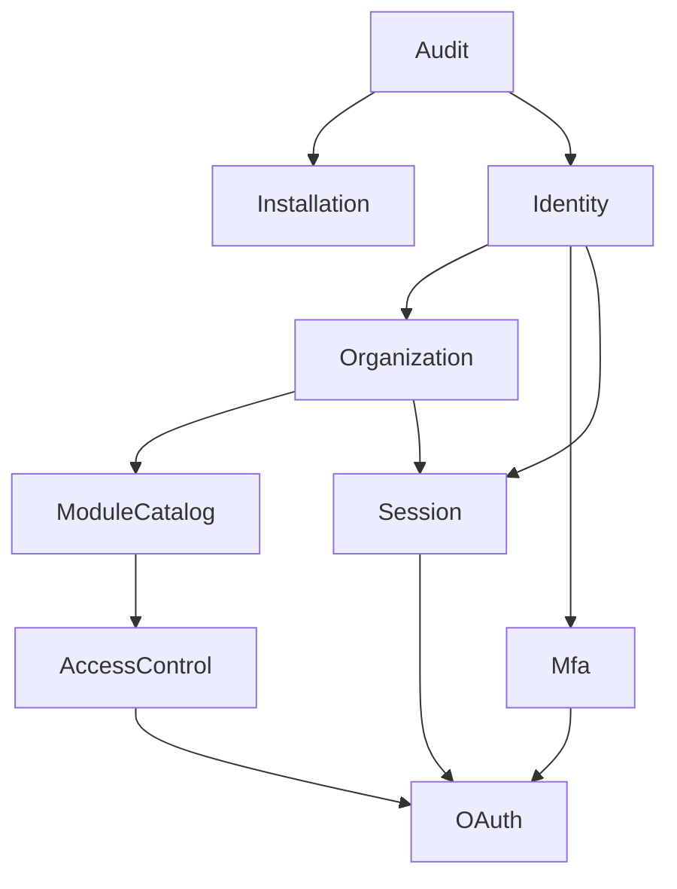

# Plano de Implementação — Laravel DDD Skeleton with Identity Platform

**Versão:** 0.1  
**Status:** Pronto para validação no repositório  
**Data:** 2026-07-24  
**Licença:** MIT  

## 1. Propósito

Este é o plano vivo para implementar o MVP definido no PRD, no TRD e nos ADRs. Ele foi escrito para que um agente de programação consiga trabalhar a partir de um repositório novo, sem depender do histórico da conversa que originou os documentos.

O plano não substitui os documentos de produto e arquitetura. Sua função é organizar a execução, explicitar dependências, definir entregas verificáveis e impedir que o projeto seja implementado como uma alteração única e difícil de revisar.

## 2. Fontes de verdade e precedência

O repositório deve conter:

```text
AGENTS.md
docs/
├── product/
│   └── PRD-Identity-Platform-v0.1.md
├── architecture/
│   ├── TRD-Laravel-DDD-Skeleton-v0.1.md
│   └── adrs/
│       ├── ADR-INDEX.md
│       └── ADR-001...ADR-007
└── implementation/
    └── IMPLEMENTATION-PLAN.md
```

Em caso de conflito:

1. um ADR aceito prevalece sobre o TRD, o PRD e este plano;
2. o TRD prevalece para decisões técnicas não cobertas por ADR;
3. o PRD prevalece para comportamento, escopo e critérios de aceitação;
4. este plano organiza a execução, mas não pode mudar decisões anteriores;
5. o código existente não transforma uma divergência em decisão válida.

Se o conflito alterar comportamento, segurança, arquitetura ou escopo, interromper a implementação do marco afetado e registrar a necessidade de correção documental ou de um novo ADR.

## 3. Como usar este plano

Antes de implementar:

1. ler integralmente `AGENTS.md`;
2. ler PRD, TRD e todos os ADRs;
3. inspecionar o estado real do repositório;
4. comparar o repositório com o marco solicitado;
5. atualizar as seções `Progresso`, `Descobertas` e `Registro de decisões`;
6. apresentar um plano de arquivos, migrations e testes do marco;
7. implementar apenas o marco autorizado.

Durante a implementação:

- manter o projeto executável;
- concluir uma fatia vertical antes de iniciar outra;
- atualizar testes junto com o comportamento;
- não antecipar funcionalidades de marcos posteriores sem dependência real;
- não alterar ADR aceito silenciosamente;
- registrar desvios e decisões novas neste documento;
- não marcar uma tarefa como concluída sem evidência verificável.

Ao concluir um marco:

1. executar todas as verificações aplicáveis;
2. revisar o diff;
3. comprovar os critérios de saída;
4. atualizar o progresso;
5. registrar dívidas intencionais;
6. apresentar os riscos residuais;
7. aguardar autorização antes do próximo marco.

## 4. Estado inicial assumido

Este plano assume um repositório novo ou quase vazio. Na primeira execução, o Codex deve verificar:

- versão efetiva de PHP, Composer, Node e Docker;
- versão estável disponível de Laravel 13 e de cada pacote;
- compatibilidade do `samuel-nunes/laravel-ddd-toolkit`;
- arquivos já criados pelo usuário;
- branch e política de commits;
- ambiente de CI escolhido;
- disponibilidade local de PostgreSQL e Redis.

Não apagar nem substituir arquivos existentes sem inspecioná-los. Se o repositório já contiver aplicação Laravel, adaptar o marco 0 preservando mudanças válidas.

## 5. Decisões não negociáveis

- Laravel 13 e PHP 8.3 ou superior compatível.
- PostgreSQL 18.x como banco principal.
- Redis com PhpRedis para cache, filas, locks, rate limiting e revogação temporária.
- Monólito modular vertical.
- Arquitetura hexagonal por padrão dentro de cada módulo.
- Uso do `samuel-nunes/laravel-ddd-toolkit`.
- Controllers em `Infrastructure/Http/Controllers`.
- Ports Out em `Application/Ports/Out`.
- Adapters em `Infrastructure`, incluindo persistência.
- Nenhum repository no Domain.
- Repository não é abstração obrigatória; preferir Port + Adapter quando existir fronteira real.
- Nenhum módulo acessa Model Eloquent ou tabela de outro módulo diretamente.
- Identidade global e autorização contextual por organização e módulo.
- Entidades importantes nunca sofrem hard delete por fluxo funcional.
- OAuth 2.0 por Laravel Passport e camada OIDC própria.
- Authorization Code com PKCE `S256`; Password Grant e Implicit Grant proibidos.
- Client Credentials faz parte do MVP.
- Vue 3, TypeScript, Inertia 3, Tailwind CSS 4 e shadcn-vue.
- Auditoria append-only.
- Psalm Taint Analysis bloqueante.
- Licença MIT.

## 6. Convenções de implementação

### 6.1 Módulos

Módulos internos previstos:

```text
Installation
Identity
Organization
ModuleCatalog
AccessControl
Mfa
Session
OAuth
Audit
```

Estrutura base:

```text
app/Modules/<Module>/
├── Domain/
├── Application/
│   ├── DTO/
│   ├── UseCases/
│   └── Ports/
│       ├── In/
│       └── Out/
└── Infrastructure/
    ├── Http/
    │   ├── Controllers/
    │   ├── Requests/
    │   └── Resources/
    ├── Persistence/
    │   ├── Adapters/
    │   └── Models/
    └── Providers/
```

Cada módulo deve documentar:

- responsabilidade;
- invariantes;
- contratos públicos;
- eventos publicados e consumidos;
- dependências permitidas;
- comandos e testes relevantes.

### 6.2 Persistência

- IDs de domínio: UUID v7 gerado pela aplicação e armazenado em `uuid`.
- Datas: `timestamptz`, tratadas em UTC.
- Metadados flexíveis: `jsonb` somente quando não houver modelo relacional estável.
- Unicidade de registros ativos: índices parciais quando apropriado.
- Integridade: constraints e foreign keys com comportamento não destrutivo.
- Alterações de autorização: transacionais.
- Migrations de produção: aditivas e compatíveis retroativamente quando possível.
- Nenhuma cascade de exclusão em entidades auditáveis.

### 6.3 Multi-tenancy

- `OrganizationContext` é explícito.
- Parâmetro vindo de Request nunca é contexto confiável.
- Toda query organizacional recebe ou deriva contexto validado.
- Scopes Eloquent podem reforçar, mas não substituir validação explícita.
- Cada adapter organizacional possui testes negativos entre organizações.
- RLS não faz parte obrigatória do primeiro corte; só habilitar após decisão registrada e testes de conexão/contexto.

### 6.4 Autorização

```text
efetivas = (herdadas ∪ concedidas diretamente) − negadas diretamente
```

Pré-condições de acesso ao módulo:

- identidade ativa;
- organização ativa;
- membership ativo;
- módulo ativo;
- módulo habilitado na organização;
- ao menos um papel ativo;
- ao menos uma permissão efetiva.

Para o MVP, `authorization_version` pode ser global por identidade. Isso invalida mais cache do que o estritamente necessário, mas mantém o comportamento seguro e simples. Uma otimização por contexto exige medição e decisão posterior.

Limite delegável padrão:

- o ator precisa possuir a permissão administrativa da ação;
- o ator só pode atuar em organizações e módulos autorizados;
- a permissão alvo precisa estar no conjunto delegável do ator;
- por padrão, o conjunto delegável não excede as permissões efetivas do ator naquele contexto;
- um papel só pode ser atribuído se todas as suas permissões relevantes estiverem dentro do limite delegável;
- permissões globais não podem ser delegadas a partir de contexto organizacional;
- autoelevação é proibida;
- exceções de proprietário ou administração global devem ser explícitas e auditadas.

Se o modelo persistente do limite delegável precisar ser mais expressivo do que essa regra derivada, registrar um novo ADR antes de criar tabelas adicionais.

### 6.5 Segurança

- não registrar senha, secret, token completo, TOTP ou recovery code;
- usar Argon2id para senha;
- cifrar segredo TOTP;
- armazenar hashes de recovery codes e client secrets;
- validar Redirect URI por igualdade exata;
- exigir PKCE `S256`;
- usar RS256, `kid` e JWKS;
- usar comparação segura para materiais secretos;
- aplicar rate limiting;
- tratar frontend somente como conveniência, nunca como barreira de autorização;
- usar queries parametrizadas, escaping contextual e allowlists.

## 7. Dependências entre módulos



As setas representam dependência de capacidade, não permissão para acessar infraestrutura interna. A comunicação deve ocorrer por contratos de aplicação.

## 8. Progresso

Atualizar datas e evidências durante a execução.

| Marco | Estado | Evidência |
|---|---|---|
| M0 — Bootstrap do repositório | Concluído | 2026-07-24 — setup Docker idempotente; PostgreSQL/Redis e health checks validados; Composer, `ddd:check`, Pint, Larastan/PHPStan, Psalm Taint Analysis, PHPUnit, npm audit/lint/typecheck/build verdes; E2E configurado, com execução local bloqueada por reinício do download da imagem no registry |
| M1 — Fundação compartilhada e auditoria mínima | Pendente | — |
| M2 — Identidade e instalação | Pendente | — |
| M3 — Organizações e catálogo de módulos | Pendente | — |
| M4 — Autorização e delegação | Pendente | — |
| M5 — Sessões e autenticação humana | Pendente | — |
| M6 — MFA e conclusão da instalação | Pendente | — |
| M7 — OAuth Clients e Passport | Pendente | — |
| M8 — OpenID Connect e PKCE | Pendente | — |
| M9 — Client Credentials | Pendente | — |
| M10 — Painel administrativo | Pendente | — |
| M11 — Aplicação de referência | Pendente | — |
| M12 — Retenção, observabilidade e hardening | Pendente | — |
| M13 — Validação integral e release do MVP | Pendente | — |

Estados permitidos: `Pendente`, `Em andamento`, `Bloqueado`, `Concluído`.

## 9. Marcos de implementação

### M0 — Bootstrap do repositório

#### Resultado observável

Uma aplicação Laravel inicia localmente, conecta a PostgreSQL e Redis, possui estrutura modular instalada, documentação no repositório e pipeline básico executável.

#### Trabalho

- criar o projeto Laravel 13;
- definir PHP compatível no `composer.json`;
- instalar Vue/Inertia/TypeScript conforme o starter kit escolhido;
- instalar `samuel-nunes/laravel-ddd-toolkit`;
- executar `php artisan ddd:install --merge-agents`;
- preservar e revisar o `AGENTS.md` resultante;
- criar os nove módulos previstos com `make:module`;
- após a geração, manter somente diretórios que contenham arquivos reais;
  diretórios vazios e placeholders `.gitkeep` não devem ser versionados apenas
  para antecipar camadas futuras;
- versionar PRD, TRD, ADRs e este plano;
- adicionar licença MIT;
- configurar Docker Compose;
- configurar PostgreSQL, Redis, Mailpit e serviços web/worker/scheduler;
- criar `.env.example` sem secrets;
- criar endpoints de liveness e readiness;
- configurar Pint, Larastan/PHPStan, Psalm Taint Analysis, plugin Laravel do Psalm e Playwright;
- criar scripts Composer/npm para verificações, incluindo `security:taint` e o futuro `security:taint-self-test`;
- criar pipeline inicial de CI;
- habilitar `ddd:check` no CI;
- documentar instalação local.

#### Arquivos e áreas esperadas

```text
AGENTS.md
LICENSE
README.md
composer.json
package.json
docker-compose.yml
docker/
phpstan.neon
psalm.xml
playwright.config.ts
.github/workflows/ci.yml ou equivalente
app/Modules/
docs/
```

#### Testes e validação

- aplicação responde ao liveness;
- readiness falha corretamente sem PostgreSQL/Redis e passa com dependências ativas;
- migrations vazias executam;
- `ddd:check` passa;
- Pint, Larastan/PHPStan, Psalm Taint Analysis, PHPUnit, lint, typecheck e build executam;
- CI parte de checkout limpo.
- a rota `/` permanece apenas como smoke test do frontend no M0 e deve ser
  substituída ou movida para o módulo responsável quando o primeiro fluxo real
  de instalação ou administração for implementado;
- liveness e readiness permanecem na camada operacional da aplicação, fora dos
  módulos de negócio.

#### Critério de saída

Outro desenvolvedor consegue clonar, configurar `.env`, subir dependências, instalar a aplicação e executar o pipeline documentado.

### M1 — Fundação compartilhada e auditoria mínima

#### Resultado observável

Os módulos possuem primitivas comuns mínimas e operações futuras conseguem registrar eventos de auditoria append-only sem depender de detalhes de persistência do módulo Audit.

#### Trabalho

- implementar Value Objects compartilhados estritamente necessários:
  - UUID v7;
  - relógio;
  - paginação;
  - correlation/request ID;
- definir tipos de ator: identidade, OAuth Client e sistema;
- criar contrato de aplicação para registrar auditoria;
- implementar tabela `audit_events`;
- implementar adapter PostgreSQL append-only;
- impedir update/delete via casos de uso comuns;
- criar middleware de correlação;
- definir redaction central de campos sensíveis;
- criar estrutura inicial de outbox transacional se necessária para efeitos externos;
- documentar contrato público do módulo Audit.

#### Invariantes

- evento de auditoria é imutável pela aplicação;
- payload não contém secrets;
- falha em auditoria de operação sensível segue política fail-closed;
- eventos não sensíveis que puderem ser assíncronos devem ser explicitamente classificados.

#### Testes

- persistência append-only;
- rejeição de update/delete;
- redaction de password, token, secret, TOTP e recovery code;
- correlação por `trace_id` e `request_id`;
- atomicidade entre operação sensível e evento quando exigida.

#### Critério de saída

Módulos posteriores conseguem auditar ações usando apenas um Port Out ou contrato de aplicação.

### M2 — Identidade e instalação

#### Resultado observável

É possível criar a instalação e a primeira identidade proprietária, criar identidades adicionais com senha temporária e personalizar dados públicos básicos. A instalação permanece em estado pendente até a configuração obrigatória de MFA do proprietário no M6.

#### Dados

- `installations`;
- `identities`;
- `identity_credentials`;
- índices de e-mail normalizado;
- estados de instalação e identidade;
- campos de soft delete e auditoria de ciclo de vida.

#### Trabalho

- implementar identidade global;
- normalizar e-mail de forma determinística;
- impedir duplicação de e-mail ativo;
- implementar credencial com Argon2id;
- implementar senha temporária:
  - definida pelo administrador;
  - hash apenas;
  - validade padrão de 24 horas;
  - máximo configurável de 72 horas;
  - troca obrigatória;
  - invalidação após uso/redefinição;
- criar instalação idempotente;
- registrar `owner_identity_id` explicitamente;
- impedir desativação/soft delete do proprietário;
- implementar transferência de propriedade como contrato pendente de step-up MFA;
- persistir configurações públicas da instalação;
- usar `APP_NAME` como valor inicial e fallback;
- não persistir secrets em `installations`;
- criar comando restrito de recuperação do proprietário, inicialmente protegido por confirmação explícita e auditoria;
- implementar desativação, soft delete e restauração de identidades;
- publicar eventos de mudança de ciclo de vida.

#### Testes

- primeira identidade vira proprietária sem depender do ID numérico;
- instalação é idempotente;
- e-mail duplicado reutiliza ou rejeita conforme caso de uso;
- senha temporária expira e não é recuperável;
- primeiro login exige troca;
- proprietário não pode ser desativado;
- soft-deleted não autentica;
- restauração respeita unicidade;
- alteração visual não aceita campos sensíveis;
- todas as ações sensíveis auditam.

#### Critério de saída

Os fluxos RF-001 e RF-002 possuem implementação backend e testes, exceto o desafio TOTP finalizado no M6.

### M3 — Organizações e catálogo de módulos

#### Resultado observável

É possível administrar organizações, memberships, módulos, audiences e habilitações de módulos com isolamento explícito.

#### Dados

- `identity_preferences`;
- `organizations`;
- `memberships`;
- `modules`;
- `organization_modules`;
- representação de audiences e scopes permitidos;
- estados e vigências.

#### Trabalho

- implementar `OrganizationContext`;
- criar, atualizar, desativar, soft-delete e restaurar organizações;
- criar e encerrar memberships preservando histórico;
- implementar política organizacional de MFA `OBRIGATÓRIO|OPCIONAL`;
- cadastrar módulos com identificador estável;
- cadastrar audiences e scopes permitidos;
- habilitar/desabilitar módulos por organização;
- armazenar última organização por identidade, nunca por módulo;
- criar serviço que liste organizações e módulos aplicáveis;
- revalidar preferência antes de reutilizá-la;
- garantir que organização/módulo desativado não participe de decisões;
- criar adapters sem acesso cruzado de Models.

#### Testes

- isolamento negativo entre organizações em cada adapter;
- preferência nunca força contexto inválido;
- módulo desabilitado bloqueia novas atribuições;
- membership encerrado remove acesso operacional;
- soft delete preserva histórico;
- índices ativos impedem duplicações;
- auditoria por escopo.

#### Critério de saída

RF-003, RF-004, RF-006 e a parte estrutural do RF-013 estão cobertos no backend.

### M4 — Autorização e delegação

#### Resultado observável

O sistema calcula permissões efetivas de forma determinística, ativa módulo somente com papel e permissão efetiva e impede delegação acima do limite.

#### Dados

- `permissions`;
- `roles`;
- `role_permissions`;
- `identity_role_assignments`;
- `permission_overrides`;
- índices parciais e constraints de escopo;
- `authorization_version`.

#### Trabalho

- criar catálogo de permissões por módulo;
- permitir criação por administrador global ou organizacional autorizado;
- garantir reutilização da permissão entre organizações do mesmo módulo;
- exigir autorização global para alterar/desativar/restaurar permissão compartilhada;
- criar papéis globais do módulo;
- criar papéis organizacionais;
- impedir composição entre módulos;
- implementar atribuição de múltiplos papéis;
- implementar `Ativar módulo` como caso de uso transacional:
  - ao menos um papel;
  - overrides opcionais;
  - ao menos uma permissão efetiva final;
- implementar override `CONCEDER|NEGAR` mutuamente exclusivo;
- impedir override sem papel ativo;
- implementar `EffectivePermissionResolver`;
- retornar origem e motivo de cada permissão;
- implementar `DelegationPolicy`;
- separar capacidades de criar, atribuir, conceder e negar;
- implementar cache Redis por versão;
- incrementar versão e invalidar após commit;
- reavaliar acesso após qualquer alteração;
- semear catálogo inicial do próprio Identity Platform;
- proteger casos de uso administrativos com permissões do catálogo.

#### Testes

- testes unitários e de propriedades do resolver;
- combinações de múltiplos papéis;
- concessão de permissão não herdada;
- negação de permissão herdada;
- substituição atômica entre efeitos;
- zero permissões desativa acesso;
- remoção do último papel desativa acesso;
- override isolado nunca ativa módulo;
- papel organizacional não cruza organização;
- permissão não cruza módulo;
- administrador somente de atribuição não cria catálogo;
- autoelevação e delegação acima do limite falham;
- concorrência de overrides mantém uma regra ativa;
- cache é invalidado pela versão;
- endpoints administrativos são autorizados no servidor.

#### Critério de saída

RF-007 a RF-010 e RN-004 a RN-009 possuem cobertura executável. O próprio painel já pode usar o resolver, mesmo antes da UI completa.

### M5 — Sessões e autenticação humana

#### Resultado observável

Identidades ativas autenticam por e-mail/senha, trocam senha temporária, mantêm sessões seguras e podem consultar/revogar as próprias sessões.

#### Dados

- `web_sessions`;
- tokens de recuperação de senha;
- campos de autenticação e revogação;
- `identity_preferences` integrado ao login.

#### Trabalho

- implementar login por e-mail/senha;
- limitar tentativas por IP e identidade;
- rotacionar sessão após login e step-up;
- cookies `Secure`, `HttpOnly`, `SameSite=Lax`;
- timeout ocioso e absoluto;
- troca obrigatória de senha temporária antes de OAuth;
- recuperação de senha;
- consulta e revogação de sessões próprias;
- revogação administrativa com permissão;
- encerramento por desativação/soft delete;
- selecionar organização automaticamente quando houver apenas uma válida;
- apresentar módulos acessíveis após contexto;
- registrar última organização válida;
- auditar sucesso, falha e revogação sem vazar credenciais.

#### Testes

- login válido/inválido e rate limit;
- enumeração de usuário mitigada;
- sessão fixa é rotacionada;
- senha temporária bloqueia continuação;
- organização e módulo únicos evitam seleção redundante;
- preferência inválida é ignorada;
- usuário vê apenas suas sessões;
- revogação encerra acesso renovável;
- CSRF nas rotas web.

#### Critério de saída

RF-011, parte do RF-013 e RF-019 funcionam sem OAuth/OIDC.

### M6 — MFA e conclusão da instalação

#### Resultado observável

TOTP pode ser configurado e validado; proprietário e contas globais sensíveis sempre usam MFA; organizações aplicam política e step-up.

#### Dados

- `mfa_methods`;
- `mfa_recovery_codes`;
- estado de autenticação forte por sessão.

#### Trabalho

- gerar segredo TOTP;
- apresentar QR Code apenas durante configuração;
- exigir primeiro código antes de ativar;
- cifrar segredo em repouso;
- gerar recovery codes mostrados uma vez e armazenados como hash;
- consumo único;
- regeneração com reautenticação;
- reset administrativo restrito e auditado;
- aplicar MFA obrigatório ao proprietário;
- classificar contas globais sensíveis;
- aplicar política organizacional após seleção da organização;
- realizar step-up ao trocar para organização obrigatória;
- registrar `amr` e `auth_time`;
- concluir instalação somente após confirmação do TOTP do proprietário;
- concluir fluxo seguro de transferência de propriedade;
- finalizar comando de recuperação administrativa.

#### Testes

- TOTP inválido não ativa método;
- segredo não reaparece;
- recovery code é de uso único;
- proprietário não desabilita MFA;
- organização opcional aceita senha;
- organização obrigatória exige OTP;
- troca de organização dispara step-up;
- reset e recuperação auditam;
- instalação incompleta não libera painel normal.

#### Critério de saída

RF-012 e fluxos de instalação/step-up estão completos.

### M7 — OAuth Clients e base Passport

#### Resultado observável

Administradores autorizados cadastram clients públicos/confidenciais por módulo, com redirects, grants, audiences, scopes e rotação de secret.

#### Dados

- tabelas técnicas do Passport;
- `oauth_clients`;
- `oauth_client_redirect_uris`;
- `oauth_client_audiences`;
- configuração de grants e scopes;
- histórico de secrets e rotação conforme necessidade.

#### Trabalho

- instalar e configurar Laravel Passport;
- manter Password e Implicit Grants desabilitados;
- adaptar Passport ao modelo do ModuleCatalog por adapters;
- cadastrar clients somente por administração da instalação;
- validar Redirect URI exata;
- diferenciar client público e confidencial;
- exibir secret uma vez;
- armazenar material seguro;
- rotacionar e revogar secret;
- soft-delete sem restaurar secret antigo;
- limitar grants, scopes e audiences;
- proteger operações por permissão;
- auditar ciclo de vida.

#### Testes

- client público não possui secret utilizável;
- client confidencial autentica com material correto;
- redirect divergente falha;
- grant não autorizado falha;
- rotação invalida material anterior conforme política;
- secret não aparece em logs/respostas posteriores;
- módulo desativado bloqueia client.

#### Critério de saída

RF-005 está implementado e Passport está pronto para os fluxos seguintes.

### M8 — OpenID Connect e Authorization Code com PKCE

#### Resultado observável

Uma aplicação interna inicia Authorization Code com PKCE, reutiliza SSO, recebe ID Token e Access Token válidos e acessa UserInfo.

#### Trabalho

- implementar endpoint de autorização;
- obrigar PKCE `S256`;
- validar client, redirect, scope, `state` e `nonce`;
- vincular code a client, organização, módulo e autorização;
- expirar code em 60 segundos e impedir replay;
- integrar seleção de organização, módulo e MFA;
- omitir consentimento interativo para clients internos confiáveis;
- registrar autorização administrativa;
- publicar discovery OIDC;
- publicar JWKS canônico em `/oauth/jwks`;
- manter `/.well-known/jwks.json` como alias de compatibilidade para atender o ADR-003;
- declarar `/oauth/jwks` como `jwks_uri` no discovery;
- implementar key ring, `kid` e rotação sobreposta;
- emitir ID Token de 5 minutos;
- emitir Access Token humano de 10 minutos;
- incluir apenas permissões do contexto/audience;
- implementar `/oauth/userinfo`;
- implementar scopes `openid`, `profile` e `email`;
- implementar `prompt=none` e `prompt=login`;
- emitir Refresh Token de 30 dias conforme política;
- rotacionar refresh token e detectar reutilização;
- implementar logout e revogação;
- implementar validação de `authz_ver`/JTI para APIs internas críticas;
- fornecer middleware reutilizável de validação de audience e principal.

#### Testes

- contrato do discovery;
- JWKS e rotação;
- PKCE ausente, plain ou inválido falha;
- redirect e nonce inválidos falham;
- code é curto e de uso único;
- ID Token valida `iss`, `aud`, `exp`, assinatura e nonce;
- ID Token não autoriza API;
- Access Token não carrega outra organização;
- audience incorreta falha;
- MFA e acesso ao módulo são reavaliados;
- refresh rotation e replay revogam família;
- logout encerra sessão renovável;
- `prompt=none` retorna erro OIDC apropriado quando interação é necessária.

#### Critério de saída

RF-014 a RF-017 e a parte humana de RF-019 estão completas, com testes de contrato.

### M9 — Client Credentials

#### Resultado observável

Um serviço confidencial obtém token próprio limitado a organização, módulo, audience e permissões de serviço, sem identidade humana.

#### Dados

- `oauth_service_authorizations`;
- vínculos de organização, audience e permissões por client;
- revogação e histórico.

#### Trabalho

- habilitar grant somente em clients confidenciais autorizados;
- autenticar client no Token Endpoint;
- exigir organização quando houver mais de uma;
- selecionar automaticamente quando houver exatamente uma;
- validar habilitação do módulo;
- separar permissões de serviço de papéis humanos;
- proibir `scope=*`;
- emitir token de 5 minutos;
- usar `sub_type=client`;
- não emitir ID Token ou Refresh Token;
- adaptar middleware para principal de serviço;
- auditar sucesso, falha, rotação e revogação;
- incrementar versão/invalidation após mudança de autorização de serviço.

#### Testes

- client público é rejeitado;
- client desativado é rejeitado;
- organização ambígua exige seleção;
- organização não autorizada falha;
- token contém somente permissões configuradas;
- token não contém usuário, `amr`, ID Token ou Refresh Token;
- middleware impede uso de principal de serviço em rota humana;
- revogação produz efeito conforme política.

#### Critério de saída

RF-018 e HU-013 estão completos.

### M10 — Painel administrativo

#### Resultado observável

Usuários autorizados administram o MVP por uma interface Vue/Inertia acessível, responsiva e protegida no servidor.

#### Trabalho

- implementar layout, navegação e contexto organizacional visível;
- implementar tema com configurações da instalação;
- páginas de:
  - instalação e identidade visual;
  - identidades;
  - organizações e memberships;
  - módulos, audiences e habilitações;
  - OAuth Clients e autorizações de serviço;
  - permissões;
  - papéis;
  - ativação de módulo para identidade;
  - permissões efetivas e origem;
  - MFA;
  - sessões;
  - auditoria;
- diferenciar visualmente herdada, concedida e negada;
- confirmar desativação, soft delete e restauração;
- exibir secrets somente uma vez;
- enviar props mínimas;
- manter autorização definitiva nos casos de uso;
- aplicar CSP, proteção contra clickjacking e acessibilidade WCAG AA;
- adicionar traduções e formatos de data configuráveis.

#### Testes

- feature tests de autorização de cada página/ação;
- TypeScript estrito;
- componentes críticos;
- Playwright para instalação, identidades, organização, ativação de módulo, overrides, MFA, sessões e personalização;
- teste negativo de manipulação manual de organização e módulo;
- navegação por teclado nos fluxos críticos.

#### Critério de saída

RF-022 e histórias administrativas prioritárias são demonstráveis pela interface.

### M11 — Aplicação de referência

#### Resultado observável

Uma aplicação Laravel separada demonstra integração real sem acessar banco ou sessão da Identity Platform.

#### Local padrão

```text
examples/reference-client/
```

Se a equipe preferir repositório separado, registrar a decisão antes deste marco. Em qualquer formato, a aplicação precisa ter processo, configuração e armazenamento próprios.

#### Trabalho

- criar módulo e OAuth Clients de exemplo;
- configurar discovery;
- gerar e armazenar `state`, `nonce` e `code_verifier`;
- iniciar Authorization Code com PKCE;
- validar ID Token por JWKS;
- criar sessão local;
- chamar API protegida com Access Token;
- demonstrar uma operação autorizada e uma negada;
- validar audience, organização e permissão;
- implementar logout;
- documentar integração;
- executar no Docker Compose sem compartilhar banco/sessão.

#### Testes

- E2E de login completo;
- nonce e state inválidos;
- PKCE inválido;
- audience errada;
- permissão ausente;
- troca de organização;
- MFA obrigatório;
- logout e refresh.

#### Critério de saída

HU-015 e a métrica de integração OIDC do PRD estão comprovados.

### M12 — Retenção, observabilidade e hardening

#### Resultado observável

O sistema possui retenção automatizada, telemetria útil, análise de taint comprovada e comportamento seguro sob concorrência e falhas.

#### Trabalho

- implementar retenção configurável:
  - auditoria: 3 anos + purge em até 30 dias;
  - logs operacionais: 90 dias;
  - traces: 30 dias;
  - métricas agregadas: 13 meses;
  - backups: política externa de até 90 dias;
- implementar `legal hold`;
- implementar purge em lotes idempotentes;
- auditar alterações de retenção e execuções;
- implementar anonimização/pseudonimização controlada;
- expurgar artefatos efêmeros após margem segura;
- instrumentar HTTP, PostgreSQL, Redis, filas e integrações com OpenTelemetry;
- adicionar spans do resolver, emissão de token e MFA;
- garantir redaction de PII e secrets;
- criar `docs/security/taint-analysis.md`;
- configurar sources/sinks específicos de Laravel;
- criar fixture vulnerável controlada fora do código de produção;
- criar `composer security:taint-self-test`, que passa somente quando o Psalm encontra o fluxo vulnerável esperado;
- manter a fixture fora do scan normal de `security:taint`, para que a validação principal continue exigindo zero achados;
- gerar SARIF no CI;
- realizar threat modeling de login, autorização, OAuth/OIDC, MFA, recuperação e administração;
- testar concorrência em overrides, rotação, refresh e instalação;
- testar indisponibilidade de Redis e política fail-closed em rotas críticas;
- medir tamanho de tokens e latência do resolver;
- documentar rotação de chaves e resposta a incidentes.

#### Testes

- relógio controlado para retenção;
- legal hold impede purge;
- purge não alcança entidades protegidas;
- job é idempotente e retomável;
- logs não contêm secrets;
- traces correlacionam sem PII desnecessária;
- Psalm Taint Analysis detecta a fixture;
- nenhum novo achado é absorvido por baseline;
- concorrência preserva invariantes;
- falha de Redis não abre rota crítica.

#### Critério de saída

RF-020, RF-021, segurança, observabilidade e política de retenção estão operacionalmente verificadas.

### M13 — Validação integral e release do MVP

#### Resultado observável

Um clone limpo pode ser instalado, testado e usado para iniciar um novo sistema.

#### Trabalho

- mapear cada RF, RN, HU e métrica do PRD para teste/evidência;
- executar pipeline completo em checkout limpo;
- revisar todos os ADRs contra o código;
- revisar dependências entre módulos;
- executar `ddd:check`;
- executar análise estática e segurança;
- executar testes backend, frontend, integração, contrato e E2E;
- testar instalação do zero;
- testar upgrade de banco compatível;
- testar backup/restore;
- revisar documentação para humanos e agentes;
- revisar licença e arquivos open source;
- revisar secrets e `.env.example`;
- produzir changelog e notas do primeiro release;
- registrar limitações conhecidas.

#### Critério de saída

Todos os critérios técnicos do TRD e as 22 métricas de aceitação do PRD possuem evidência. Não existem falhas bloqueantes, hard deletes proibidos, violações arquiteturais ou achados de taint.

## 10. Matriz resumida de rastreabilidade

| Marco | Requisitos principais |
|---|---|
| M0 | Restrições técnicas, documentação e base do MVP |
| M1 | RF-020, auditoria transversal |
| M2 | RF-001, RF-002, HU-002 e backend de HU-014 |
| M3 | RF-003, RF-004, RF-006, parte do RF-013, HU-001, HU-003 |
| M4 | RF-007 a RF-010, HU-004 a HU-006, HU-011, HU-012 |
| M5 | RF-011, RF-019, parte do RF-013, HU-010 |
| M6 | RF-012, HU-007 |
| M7 | RF-005 |
| M8 | RF-014 a RF-017, parte humana do RF-019, HU-008, HU-009 |
| M9 | RF-018, HU-013 |
| M10 | RF-022, conclusão de HU-014 e histórias administrativas |
| M11 | HU-015 e interoperabilidade |
| M12 | RF-020, RF-021 e requisitos não funcionais |
| M13 | Métricas 1 a 22 e critério técnico de conclusão |

## 11. Verificações obrigatórias

Após M0, todo marco deve executar o subconjunto aplicável; antes do release, todos são obrigatórios:

```bash
composer validate
php artisan ddd:check
vendor/bin/pint --test
vendor/bin/phpstan analyse
composer security:taint
composer security:taint-self-test
vendor/bin/phpunit
npm run lint
npm run typecheck
npm run build
npx playwright test
composer audit
npm audit
```

Se um comando ainda não existir, o marco responsável deve criá-lo. Não omitir verificação silenciosamente.

## 12. Estratégia de commits e revisão

Limites sugeridos:

- bootstrap e dependências;
- uma migration coesa;
- domínio e casos de uso de uma capacidade;
- adapter e testes de integração;
- endpoint e feature tests;
- página e E2E;
- documentação do marco.

Não misturar refactor não relacionado. Não fazer push, merge, release ou alteração remota sem autorização explícita.

Antes de aceitar cada marco:

- revisar o diff contra o escopo;
- procurar mudança não documentada;
- procurar acesso cruzado de módulo/organização;
- procurar exposição de segredo;
- procurar hard delete;
- procurar autorização aplicada apenas no frontend;
- procurar testes que validam somente caminho feliz.

## 13. Descobertas

Esta seção é viva. Registrar fatos descobertos durante a execução que afetem o plano.

| Data | Marco | Descoberta | Impacto |
|---|---|---|---|
| 2026-07-24 | M0 | O host não possui PHP nem Composer utilizáveis, e o Node local está obsoleto | O fluxo local e todas as verificações foram definidos para Docker |
| 2026-07-24 | M0 | Psalm 6.16 exige PHP 8.3.16 ou superior dentro da linha 8.3 | A versão mínima efetiva passou a ser PHP 8.3.16 e o lockfile foi resolvido nessa plataforma |
| 2026-07-24 | M0 | Resolver o lock em PHP 8.4 selecionou Symfony 8.1, incompatível com PHP 8.3 | `config.platform.php=8.3.16` fixa Symfony 7.4 e mantém a matriz PHP 8.3/8.4 instalável |
| 2026-07-24 | M0 | A versão estável 4.x do plugin Laravel para Psalm depende da linha beta do Psalm 7 | M0 usa as linhas estáveis compatíveis Psalm 6.16 e `psalm/plugin-laravel` 3.15, sem baseline |
| 2026-07-24 | M0 | Manter o CLI `shadcn-vue` 2.8 no lockfile introduziu advisories npm transitivos | O CLI não é dependência persistente; foram mantidos `components.json` e somente as dependências runtime sem advisories |
| 2026-07-24 | M0 | O tag `nginx:1.30.4-bookworm` planejado não existe no registry oficial | O serviço web foi fixado no tag oficial existente `nginx:1.28.3` |
| 2026-07-24 | M0 | Health checks dentro do grupo `web` dependiam da sessão Redis | As rotas de health são stateless; liveness permanece 200 e readiness retorna 503 quando PostgreSQL ou Redis falha |
| 2026-07-24 | M0 | O download local da imagem Playwright reiniciou após falha em uma camada de 791,3 MB | O teste e o job CI estão prontos, mas a execução E2E local ficou sem evidência por limitação do registry/rede |

## 14. Registro de decisões de implementação

Decisões reversíveis e locais podem ser registradas aqui. Decisões arquiteturais duradouras exigem ADR.

| Data | Marco | Decisão | Motivo |
|---|---|---|---|
| 2026-07-24 | Planejamento | `authorization_version` global por identidade no MVP | Opção segura e simples; otimização contextual fica condicionada a medição |
| 2026-07-24 | Planejamento | Aplicação de referência em `examples/reference-client` por padrão | Mantém execução conjunta e isolamento de aplicação; pode migrar para repositório separado |
| 2026-07-24 | Planejamento | `/oauth/jwks` canônico e `/.well-known/jwks.json` como alias | Concilia o PRD/TRD com o endpoint registrado no ADR-003 |
| 2026-07-24 | M0 | PHP mínimo 8.3.16, runtime Docker 8.4 e CI em 8.3/8.4 | Atende Laravel 13 e a restrição estável do Psalm sem abandonar a versão mínima definida pelo TRD |
| 2026-07-24 | M0 | Frontend Inertia/Vue mínimo, sem starter kit de autenticação | Evita antecipar autenticação, autorização e UI administrativa de marcos posteriores |
| 2026-07-24 | M0 | Passport permanece adiado para M7 | M0 cria somente a fundação; instalar Passport agora anteciparia decisões e migrations OAuth |
| 2026-07-24 | M0 | PostgreSQL usa papéis administrativo e de aplicação separados no schema compartilhado | Reduz privilégio do runtime sem introduzir multi-tenancy ou RLS fora do escopo |
| 2026-07-24 | M0 | Psalm é executado somente em modo Taint Analysis, sem baseline; o self-test vulnerável permanece como guard até M12 | Larastan/PHPStan cobre a análise estática geral, enquanto Psalm fica restrito ao rastreamento de dados não confiáveis definido pelo TRD |
| 2026-07-24 | M0 | `APP_PORT` pode sobrescrever a porta web local | Permite bootstrap sem interferir em outros projetos e preserva 8080 como padrão |
| 2026-07-25 | Revisão do M0 | A árvore gerada continha diretórios futuros mantidos apenas por `.gitkeep` | O repositório passa a versionar somente diretórios com arquivos reais; cada camada surge quando for implementada |
| 2026-07-25 | Revisão do M0 | `/` é uma tela de smoke test, enquanto `/health/*` é infraestrutura operacional | A home temporária será substituída pelo módulo dono do primeiro fluxo; health permanece fora de `Installation` |

## 15. Riscos e respostas

| Risco | Resposta |
|---|---|
| Escalada por delegação | Policy central, limite derivado, testes negativos e auditoria |
| Vazamento entre organizações | Contexto explícito, adapters testados e tokens por organização |
| OIDC parcial ou inseguro | Passport para OAuth, contratos OIDC, threat model e testes de protocolo |
| JWT revogado continuar válido | Vida curta, `authz_ver`, JTI e refresh rotation |
| Token grande | Uma organização/audience por token e somente permissões do módulo |
| Hard delete acidental | Sem casos de uso destrutivos, FKs restritivas e testes de ciclo de vida |
| Auditoria conter segredo | Redaction central e testes de payload |
| Taint analysis verde sem rastrear Laravel | Plugin, sources/sinks próprios e fixture vulnerável |
| Plano divergir do repositório | Validação antes de cada marco e atualização das seções vivas |
| Implementação extensa demais | Um marco por vez, fatias verticais e critérios de saída |

## 16. Definição global de pronto

O MVP só está pronto quando:

- comportamento corresponde ao PRD;
- arquitetura corresponde ao TRD e ADRs;
- todos os endpoints administrativos autorizam no servidor;
- isolamento organizacional possui testes negativos;
- acesso a módulo exige papel e permissão efetiva;
- OAuth/OIDC e Client Credentials passam nos contratos;
- nenhuma entidade protegida possui hard delete funcional;
- auditoria e retenção estão operacionais;
- Psalm Taint Analysis é bloqueante e comprovado;
- aplicação de referência integra sem compartilhamento de banco ou sessão;
- pipeline completo passa em checkout limpo;
- documentação permite clonar, instalar, integrar um módulo e continuar o desenvolvimento.

## 17. Prompt recomendado para iniciar cada marco

```text
Leia integralmente o AGENTS.md, o PRD, o TRD, todos os ADRs e o
IMPLEMENTATION-PLAN.md.

Inspecione o estado atual do repositório e trabalhe somente no marco <MARCO>.

Antes de editar:
1. compare o marco com o estado real do código;
2. atualize Progresso, Descobertas e Registro de decisões quando necessário;
3. liste arquivos, migrations, contratos e testes previstos;
4. reporte conflito com PRD, TRD ou ADR;
5. não implemente marco posterior.

Depois da validação do plano do marco, implemente a fatia completa, execute as
verificações aplicáveis, revise o diff e apresente evidências dos critérios de
saída. Não faça push, merge ou release sem autorização explícita.
```
